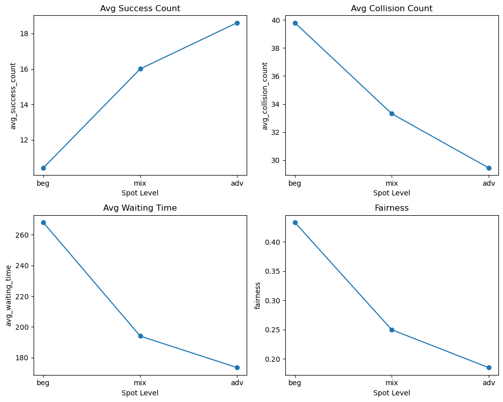
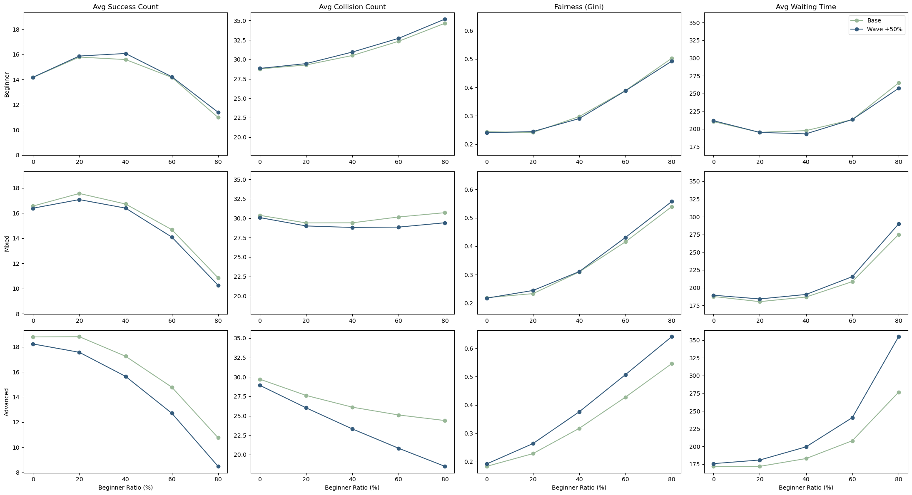

# SurfSim: A Monte Carlo Simulation of Surfing Dynamics
## Project Overview
This project uses **Monte Carlo simulation** to analyze the dynamics of a surf lineup. It focuses on how ocean conditions and the mix of surfers affect safety and wave sharing.

The simulation models the interaction between:

* **Ocean Conditions:** Stochastic generation of wave heights, wave counts, and set intervals
* **Surfer Behavior:** Different skill levels and competitive styles

**Key Metrics:**

* **Safety:** Frequency of collisions
* **Performance:** Success rate of rides
* **Fairness:** How evenly waves are shared among the crowd
* **Efficiency:** Average waiting time (defined as the time between two successful rides)

## Hypotheses & Objectives
The primary goal of this project is to investigate the following hypotheses:

1.  **Hypothesis 1:** Under Free-for-All rules, advanced lineups are more efficient and fair (lower waiting time and Gini score) compared to chaotic beginner lineups.
2.  **Hypothesis 2:** The 'Safe-Distance' rule effectively reduces collisions but creates a trade-off by decreasing the number of successful rides and increasing waiting times.
3.  **Hypothesis 3:** Higher wave heights will reduce the number of collisions, even when there is a high percentage of beginners.

**Key Objectives:**
* To simulate surfer interactions and wave dynamics under different crowd compositions (e.g., skill levels) and rule sets.
* To visualize the trade-off between safety (collision rate) and performance (waiting time/successful rides) when using different rules.
* To analyze how wave conditions affect lineup efficiency, safety, and fairness (Gini score) in sharing waves.

## Key Variables

Random Variables:
| Variable Name | Unit | Distribution | Description |
| :--- | :--- | :--- | :--- |
| `wave_height` | meters | Lognormal | The height of the ocean wave |
| `delta_t` | sec | Gamma | Time gap between wave sets |
| `wave_counts` | count | Poisson | Number of waves in each wave set |
| `skill` | 0-1 | Beta | Determines the probability of successfully catching a wave or wiping out |

Control Variables:
| Variable Name | Type | Description |
| :--- | :--- | :--- |
| `spot_level` | Categorical | `beginner`, `mixed`, `advanced` <br> (Defines the crowd's skill distribution and surfing conditions) |
| `rule_type` | Categorical | `safe-distance-rule`, `free-for-all` <br> (Defines priority rules) |

## Project Structure
```text
project-root/
├── tests/               # Unit tests to verify code logic (using pytest)
├── src/                # Source code for simulation and analysis
│   ├── simulation.py   # Core simulation engine (manages time steps and object instantiation)
│   ├── surfer.py       # Surfer class definition (blueprint for agent behavior and logic)
│   ├── wave.py        # Wave class definition (blueprint for wave attributes)
│   ├── config.py       # Global constants and simulation hyperparameters
│   └── MC_Sim.ipynb    # Jupyter Notebook for interactive testing and prototyping
├── figures/            # Generated plots and visualization results
├── main.py             # Entry point to run the full simulation
├── requirements.txt    # Python dependencies
└── README.md           # Project documentation
```

## Getting Started

### 1. Prerequisites
Install the required dependencies using pip:
```bash
pip install -r requirements.txt
```

### 2. Usage
Run the main simulation script with the specified parameters:
```bash
python main.py
```

## Results
Here are the main findings from our Monte Carlo simulation.

### 1. Spot Comparison (H1)
Our results **strongly supported** the hypothesis: Higher skill levels make the lineup run much smoother and safer.


* **Efficiency Boost:** Moving from Beginner to Advanced, the average success count **doubles**, while collisions drop by ~25%.
* **Less Waiting:** Waiting time drops significantly in advanced spots.
    * *Reason:* Beginners waste a lot of time missing waves or wiping out, whereas advanced surfers are consistent and cycle through waves quickly.
* **The "Fairness" Surprise:**
    * We found that the Gini Index **dropped** (became fairer) in advanced spots.
    * *Insight:* Instead of a few pros hogging everything, skilled surfers actually share waves more evenly compared to the chaotic distribution in beginner spots.

### 2. Rule Analysis (H2)
Contrary to our expectations, the simulation results were **surprisingly similar** regardless of the rules.

* **Skill > Rules:** Across all spot levels, success and collision rates remained almost identical. This suggests that **skill level** plays a much bigger role in safety than specific rules do.
* **The "Fairness Paradox" (Beginner Spot):**
    * We found that the "Safe-Distance" rule actually made the beginner spot **less fair**!
    * *Reason:* The rule acts as a barrier. It restricts struggling surfers from going for waves, while the "Free-for-All" chaos ironically gives everyone a random, equal chance to try.
* **Redundancy (Advanced Spot):**
    * In Advanced spots, the difference between rules practically disappears.
    * *Reason:* Pros don't need a rule to tell them how to surf. They naturally space themselves out and pick waves efficiently, making the "Safe-Distance" rule redundant.

### 3. Sensitivity Analysis (H3)
We hypothesized that higher waves would act as a filter. The results **partially supported** this.

* **The "Filtering Effect":** Increasing wave height by 50% didn't change much in the Beginner spot. However, in Mixed and Advanced spots, the bigger waves actually **lowered collision counts**.
* **Collision Paradox:**
    * *Beginner Spots:* More beginners = More crashes (as expected).
    * *Advanced Spots:* Interestingly, more beginners led to **fewer** crashes!
    * *Reason:* The waves were too difficult for the beginners to catch, so they didn't even have the chance to collide.
* **Conclusion:** Advanced spots are much more sensitive to wave conditions. Changes in wave height have a huge impact there, whereas beginner spots remain relatively stable.

## References
1. Longuet-Higgins, M. S. (1952). On the statistical distribution of the heights of sea waves. *Journal of Marine Research*, *11*(3), 245-266.
2. Holthuijsen, L. H. (2007). *Waves in oceanic and coastal waters*. Cambridge University Press.
3. Ochi, M. K., & Tsai, C. H. (1983). Prediction of non-Gaussian random processes. *Journal of Ship Research*, *27*(03), 177-184.
4. Helbing, D., Farkas, I., & Vicsek, T. (2000). Simulating dynamical features of escape panic. *Nature*, *407*, 487–490.

---

This project is the final assignment for IS597 - Programming & Quality in Analytics (Fall 2025).

